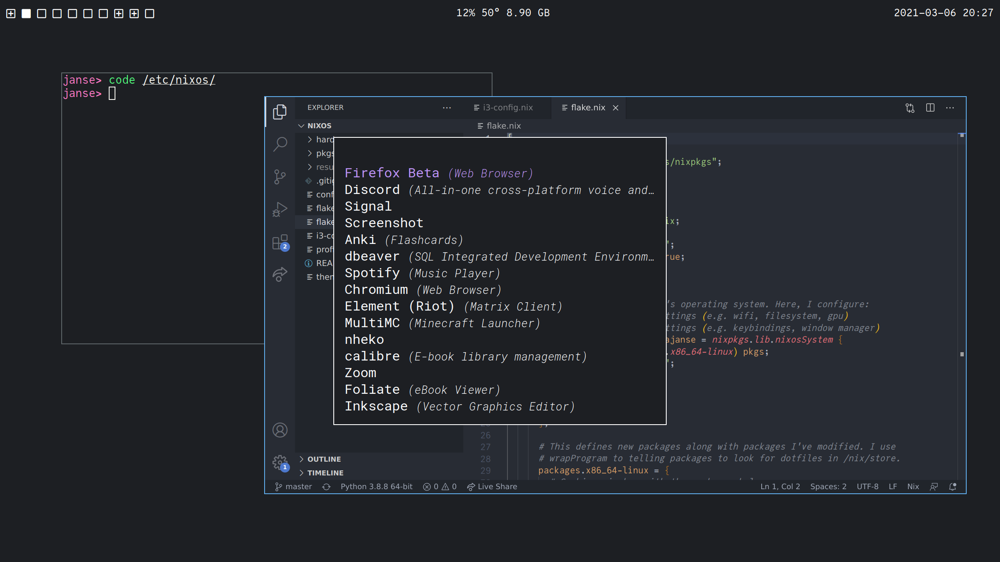

This is a collection of my dotfiles, written in Nix.

### Operating System

I use i3 ([i3-config.nix](./i3-config.nix)), Alacritty ([pkgs/alacritty.nix](./pkgs/alacritty.nix)), and VSCode ([pkgs/vscode.nix](./pkgs/vscode.nix)). I use Nix to ensure a consistent experience across applications, from keybindings to fonts to color schemes ([theme.nix](./theme.nix)).



### Profiles

I use `nix profile` to manage which packages I have installed. More specifically, I install the `buildEnv` packages in [profile.nix](./profile.nix). To try out the small set of tools I share across my laptop and servers, run:

```
nix shell github:aaronjanse/dotfiles#profiles.common
```

### Packages

Because this is a Nix Flake, you can easily try out some of the packages I use.

##### Julia with pre-compiled sysimage for common packages

```
nix shell github:aaronjanse/dotfiles#julia
```

##### Signal Desktop with custom color scheme

```
nix shell github:aaronjanse/dotfiles#signal-desktop
```
